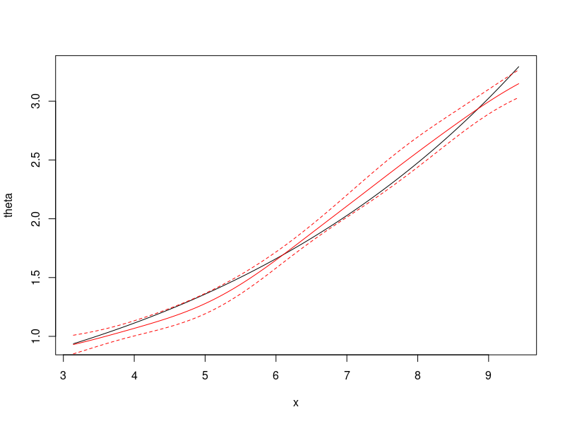
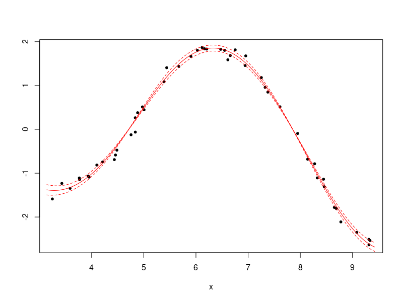

```{r setup, include=FALSE}
knitr::opts_chunk$set(echo = TRUE)
```


## Implementing the Computer Model

In the case of cheap code, the computer model is known and can be easily computed. The user need to implement the model and compute its derivatives in the package `calibration`. Note the package is implemented via the c++ math library `Armadillo`.
The user can learn the syntax via <http://arma.sourceforge.net/docs.html>.
We take the first simulation setting as an example and illustrate how to implement a computer model on your own.

In the first setting of this work, the physical response is 
$$y^p(x) = \exp(x/10) \cos(x) + \sigma e$$ 
for $x\in[\pi, 3\pi]$, where $\sigma=0.1$ and $e \sim N(0,1)$. The
computer model is $$y^s(x, \theta) = 0.5 \exp(x/10) \cos(x) \frac{\exp(x/5)}{\theta}$$ with the calibration parameter $\theta$.
The optimal calibration function is $\theta^{*}(x) = 0.5 \exp(x/5)$. The emulator is trained on the domain $[\pi,3\pi]\times[\pi/5, 6\pi/5]$.

Note the first and second order derivative of $y^s(x, \theta)$ with respect to $\theta$ are
$$\frac{\partial y^s(x, \theta)}{\partial \theta} = -0.5 \exp(x/10) \cos(x) \frac{\exp(x/5)}{\theta^2}$$
and 
$$\frac{\partial^2 y^s(x, \theta)}{\partial \theta^2} =  \exp(x/10) \cos(x) \frac{\exp(x/5)}{\theta^3}$$
receptively.


This computer model is implemented in the file `calibration/src/simuObj.hpp`. The C++ class `simuobj_simu1` inherits from `simuobj`, and overrides  three functions.

- The function `yModel` evaluates the value of $y^p(x,\theta)$.
- The function `yModelPartial` evaluates the first order derivative of $y^p(x,\theta)$ with respect to $\theta$.
- The function `yModelPartial2O` evaluates the second order derivative of $y^p(x,\theta)$ with respect to $\theta$.

```cpp
// File: calibration/src/simuObj.hpp
// the first simulation setup
class simuobj_simu1:
    public simuobj{
public:
    vec yModel(const mat & theta, const mat & dataXReal){
        vec result, coreF; 
        coreF = exp(dataXReal / 10.0) % cos(dataXReal);
        result = 0.5 * exp(dataXReal/5.0);
        result =  coreF % result / theta;
        return result;
    }
    mat yModelPartial(const mat & theta, const mat & dataXReal){
        vec result, coreF;
        coreF = exp(dataXReal / 10.0) % cos(dataXReal);
        result = 0.5 * exp(dataXReal/5.0);
        result =  - coreF % result / (theta % theta);
        return result;
    }
    
    mat yModelPartial2O(const mat & theta, const mat & dataXReal){
        vec coreF, result;
        coreF = exp(dataXReal / 10.0) % cos(dataXReal);
        result =  0.5 * exp(dataXReal/5.0);
        result =  2.0 * coreF % result / (theta % theta % theta);
        return result;
    }
    
};
```

The above functions take `theta` and `dataXReal` as input, which are matrices of size 
$n\times 1$ (i.e. a vector). Each row of the matrices corresponds to one observation. In math notations, the function inputs `theta` and `dataXReal` are
$$
\begin{pmatrix}
\theta(x_1) \\ \theta(x_2) \\ \vdots \\ \theta(x_n)
\end{pmatrix}\quad \text{and} \quad
\begin{pmatrix}
x_1 \\ x_2 \\ \vdots \\ x_n
\end{pmatrix},
$$
respectively.


See the `problemIndex` in the next section.
```cpp
// File: calibration/src/methodBase.cpp
void methodBase::selectSimulator(int c1){
    switch(c1){
    case 1:
        simulator = std::make_shared<simuobj_simu1>(); 
        break;
    case 2:
        simulator = std::make_shared<simuobj_simu2>(); 
        break;
//    case 3:
//        simulator = std::make_shared<myModel>(); 
//        break;
    default:
        simulator = std::make_shared<simuobj_GP>(); break;
    }
}
```

## Use the computer model

Compile and re-install the package after any modification. 
To use the package, let's first load the package and related functions.
```r
library(calibration)
source("./code/core/loadAll.R")
```


 Recall the first simulation setting has true physical model  $y^p(x) = \exp(x/10) \cos(x) + \sigma e$ for $x\in[\pi, 3\pi]$. Let's generate a sample of size $n=50$.
```r
lowerB = 1 * pi
upperB = 3 * pi
nSample = 50
set.seed(49)
y_physics =  function(nSample, lowerB, upperB){
    xData = runif(nSample, lowerB, upperB)
    yData = exp(xData / 10) * cos(xData)  + rnorm(nSample, sd = 0.1)
    xData = matrix(xData, nrow = nSample)
    yData = matrix(yData, nrow = nSample)
    return(list(x = xData, y = yData))
}
simuData = y_physics(nSample,lowerB, upperB)
str(simuData)
#List of 2
# $ x: num [1:50, 1] 5.44 6.21 4.84 6.95 3.43 ...
# $ y: num [1:50, 1] 1.406 1.832 0.263 1.676 -1.233 ...
```

The optimal calibration function is $\theta^{*}(x) = 0.5 \exp(x/5)$. We want to constrain the calibration function in the range `[linkLowerB, linkUpperB]` during optimization.
```r
thetaTrueFun = function(xx){
    exp(xx/5) / 2
}
TrueSeqX = seq(lowerB, upperB, length.out = 200)
TrueSeqX = matrix(TrueSeqX, nrow = 200)
TrueSeqTheta = thetaTrueFun(TrueSeqX)
linkLowerB = min(TrueSeqTheta) * 0.7
linkUpperB =  max(TrueSeqTheta) * 1.1
```

The R code below creates an R object of the C++ class `calModel`. It also feeds the dataset into the class object `calObjCC`.
```r
calObjCC = create_CalibrationObj(problemIndex = 1, 
                         thetaIndex = 5, linkIndex = 2, 
                         linkLowerB = linkLowerB, 
                         linkUpperB = linkUpperB)
calObjCC$setData(simuData$y, simuData$x,  lowerB, upperB)
```

- Setting `problemIndex=1` will select the computer model `simuobj_simu1` as discussed in the previous section. This is the computer model for the first simulation setting. 
- Setting `thetaIndex=5` corresponds to the proposed RKHS cubic spline model. See the table below for more information.

| `thetaIndex` | Calibration Model |
|--------------|-------------------|
| 1            | The constant model |
| 2            | The exponential model |
| 3            | The quadratic model |
| 4            | The RKHS linear model (Sobolev space of order 1) |
| 5            | The RKHS cubic model (Sobolev space of order 2) |


- Additionally, setting `linkIndex=2` will constrain the  value of the calibration function $\theta(x)$ in the range `[linkLowerB, linkUpperB]` during optimization.
When `linkIndex=1`, no constraint will be imposed.


The optimization will take multiple trials with random initial values and select the final result with the optimal objective function value. We need to write a function providing the random initial values. Suppose $n$ is the sample size, 
the RKHS cubic model will have $n+2$ parameters to be optimized. Specifically, for RKHS cubic model, the calibration function has the form
$$\theta(x)=  \sum_{s=1}^2 \alpha_{s} v_{s}(x) +
\sum_{i=1}^n\beta_{i} \Phi( x,  x_i)\, ,
$$
where $v_s$ is the null space basis and $\Phi$ is the reproducing kernel.
The function `getInitGamma` below returns a random vector of size $n+2$.

```r
getInitGamma = function(nSample){
    gammaInit = rnorm(nSample + 2, mean = 0, sd = 10)
    return(gammaInit)
}
```

We next select the tuning parameter $\lambda$ via GCV among the candidate values `lambdaSeqCubic`.
```r
set.seed(10)
lambdaSeqCubic = exp(seq(-16, -10,length.out = 30))
result = selectLambdaGCV(calObjCC, lambdaSeqCubic, 
                         nSample, 
                         getInitGamma, 
                         TrueSeqX, 
                         linkLowerB, linkUpperB,
                         plotcv = FALSE)
calObjCC$setLambda(result$lambdaOpt)
```

In `result$gammaOpt` is the optimal fitted $\boldsymbol \gamma = (\boldsymbol \alpha^T,\boldsymbol \beta^T)^T$. We can find the fitted values of 
$y(x, \theta(x))$ and $\theta(x)$ at a sequence of $x$ in `TrueSeqX`.
Suppose the length of `TrueSeqX` is $m$. Then, `yFitted` will be a matrix of size $m\times 4$. The first two columns have the the fitted value of $y(x, \theta(x))$ and its one-sigma uncertainty. The last two columns have the the fitted value of 
$\theta(x)$ and its one-sigma uncertainty. 

```r
yFitted = calObjCC$predict_y(result$gammaOpt, TrueSeqX, TRUE)
head(yFitted)
#         [,1]       [,2]      [,3]       [,4]
#[1,] -1.379236 0.05974630 0.9303457 0.04047615
#[2,] -1.384972 0.05869586 0.9348438 0.03977955
#[3,] -1.389283 0.05760093 0.9394055 0.03909550
#[4,] -1.392155 0.05646899 0.9440288 0.03842655
#[5,] -1.393576 0.05530764 0.9487115 0.03777542
#[6,] -1.393536 0.05412408 0.9534515 0.03714463
```

We can plot the optimal calibration function (in black solid curve) and the fitted calibration function (in red solid function). The dashed lines represent 95% confidence intervals.
```r
plot(TrueSeqX, TrueSeqTheta,type = "l",xlab = "x", ylab = "theta")
lines(TrueSeqX, yFitted[,3],col = "red")
lines(TrueSeqX, yFitted[,3]+1.96*yFitted[,4],col = "red",lty = 2)
lines(TrueSeqX, yFitted[,3]-1.96*yFitted[,4],col = "red",lty = 2)
```



We also plot the observations (black point) and the fitted response curve (red curves).
```r
plot(simuData$x,simuData$y,pch = 20, xlab = "x", ylab = "")
lines(TrueSeqX, yFitted[,1],col = "red")
lines(TrueSeqX, yFitted[,1]+1.96*yFitted[,2],col = "red",lty = 2)
lines(TrueSeqX, yFitted[,1]-1.96*yFitted[,2],col = "red",lty = 2)
```
